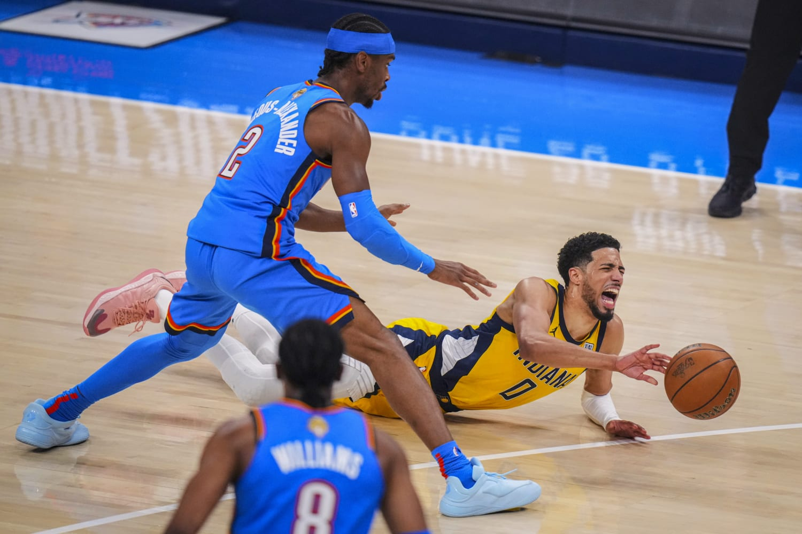

```{r setup, include=FALSE}
source("00_Data_Setup.R")
load("Part1_Causal_Results.RData")
load("Part2_Predictive_Results.RData")
```

:::: hero-banner
# NBA (Achilles) Load Management Study
A Causal and Predictive Analysis of Player Injury Burden

::: badge-red
Certified Data Analyst (R) Specialist CAPSTONE 2025 | Revised in April 2026
:::

<br>

*"Imagine if stars like Tatum, Haliburton, and KD could have avoided
those injuries. No more 'in the perfect world' or 'in another world' —
no more what-ifs. This project turns what-ifs into actionable foresight."*

<br>

**Keziah Vickraman**
::::

------------------------------------------------------------------------

## The Problem | Reason for this project

The 2024–25 NBA season recorded **8 confirmed Achilles ruptures** —
nearly **6× the historical average of 1.36 per season**. Commissioner
Adam Silver convened an expert panel, citing workload intensity and
scheduling as primary concerns. The question this project asks is simple:
could we have seen this coming?

{width=80%}


------------------------------------------------------------------------

## What **DID** this project tackle?

This study approaches the problem from two complementary angles. B-hat and Y-hat worlds colliding. 

::: {.grid}

::: {.g-col-6}
### Part 1 — DID Load Kill the Achilles? | Causal Inference (B-Hat)

**Causal inference** using a *D*ifference-*i*n-*D*ifferences design on
confirmed rupture cases (1990–2025). A 2016 policy cutoff and load × B2B
interaction terms estimate whether high workload *caused* the spike —
or merely correlates with it.

[Read the causal analysis →](part1_causal.qmd){.btn .btn-primary}
:::

::: {.g-col-6}
### Part 2 — Who's Next? | Machine Learning (Y-Hat)

**Supervised Machine Learning** using XGBoost regression on `pct_games_missed`
— a continuous target built entirely from box score data — with a
temporal train/test split (2018–2021 train, 2022–2025 test) that
honestly simulates deployment.

[See the predictions →](part2_predictive.qmd){.btn .btn-danger}
:::

:::

::: {.callout-note}
## The thread connecting both parts
The same load features — rolling 3-game average minutes, back-to-back
games, days of rest — explain the population-level spike in Part 1 and
power the individual risk scores in Part 2. Load is the mechanism; the
model is the lens.
:::

------------------------------------------------------------------------

## Key Results

::: {.grid}

::: {.g-col-6}
### Part 1 | Findings

**High-load player-seasons show a positive and amplified rupture rate
post-2016**, especially in back-to-back contexts. Load management
protected the stars — but median player loads increased. Rotation
players outside formal rest protocols are the most exposed group.

**Recommendation:** Load management cannot be a privilege reserved for max-contract stars. Extend rest protocols across full rosters — especially rotation players who carry high minutes without the protection of formal rest agreements. One back-to-back too many is not bad luck. It is a preventable decision.
:::

::: {.g-col-6}
### Part 2 | Findings

**R² = 0.747 on held-out 2022–2025 data.** Top predictors: prior
absence rate, rolling minutes, career tenure. Luka Dončić was flagged
Moderate Risk from his 2024 load profile — he subsequently missed 22%
of the 2025–26 season with a Grade 2 hamstring strain.

**Recommendation:** Run this model before each season. Treat a 30%+
prediction as a roster problem, not just a medical one. Don't bench
your player based on vibes. Instead, **"bench the instinct"**, trust the data and get your signals amidst the noise.
:::

:::

::: {.callout-important}
## The bottom line
**$4M average cost per rupture. Up to $70M for a max-contract star.**
The gap between intention and action in injury prevention is not a data
problem. It is a tools problem. This project is one step toward closing it.
:::

------------------------------------------------------------------------

## Key Findings

::: panel-tabset
### The Spike

```{r spike-preview, echo=FALSE, fig.height=4.5}
spike_VIZ
```

### Load Over Time

```{r load-preview, echo=FALSE, fig.height=4}
load_trend_VIZ
```
:::

------------------------------------------------------------------------

## The Data

```{r data-summary, echo=FALSE}
#| label: tbl-data-summary
#| tbl-cap: "Data sources used across both parts of the study"

tibble::tribble(
  ~Source,                    ~Coverage,         ~Used_For,
  "hoopR (NBA box scores)",   "2002–2025",       "Game-level features, pct_games_missed (Part 2)",
  "Pro Sports Transactions",  "1990–2023",       "Confirmed Achilles ruptures (Part 1 DiD)",
  "ESPN injury log",          "2024–25 season",  "Recent rupture cases + injury flags",
  "Manual curation",          "2024–25 season",  "8 confirmed 2024–25 Achilles ruptures"
) |>
  knitr::kable(col.names = c("Source", "Coverage", "Used for"),
               align = c("l", "l", "l"))
```

------------------------------------------------------------------------

## Reproducibility

All code is fully reproducible. Run in this order:

```{r run-order, eval=FALSE}
source("00_Data_Setup.R")          # 1. Shared data foundation
source("Part1_Causal_DiD.R")       # 2. Causal analysis
source("Part2_Predictive_Hurdle.R") # 3. Predictive model
shiny::runApp("Capstone_Shiny.R")  # 4. Interactive dashboard
```

::: callout-tip
## Render this website locally

``` bash
quarto render            # renders all pages into /docs
quarto preview           # live preview with hot reload
quarto publish gh-pages  # deploy to GitHub Pages
```
:::

------------------------------------------------------------------------

## Author

| Member | Role |
|---|---|
| Keziah Vickraman | Data collection, feature engineering, causal analysis, predictive modelling, Shiny app, write-up |


------------------------------------------------------------------------

*Capstone Project · 2025 · Keziah Vickraman· All analysis conducted in R using tidymodels, hoopR, and Quarto.*
