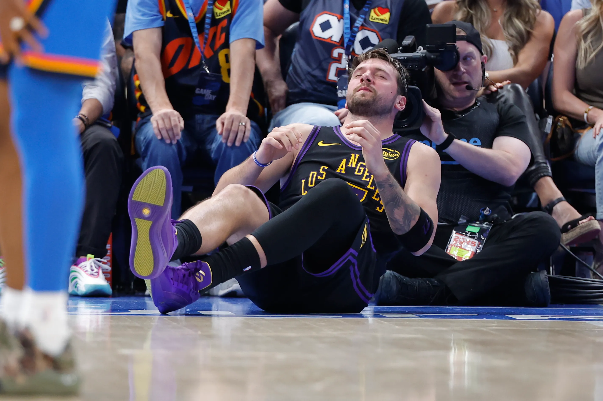

```{r setup, include=FALSE}
knitr::opts_chunk$set(echo = FALSE, warning = FALSE, message = FALSE)
source("00_Data_Setup.R")
load("Part1_Causal_Results.RData")
load("Part2_Predictive_Results.RData")
```

::: {.callout-note}
## What this section answers
**WHO** is at risk of missing significant game time next season — and **how much**?

Part 1 established that load drives the rupture spike at the population level.
Part 2 uses the same load features to build an individual-level prediction engine
that gives teams actionable risk scores before the season begins.
:::

---

## 1. The Target Variable — `pct_games_missed`

The original model used a binary Achilles rupture flag as the outcome. That approach
had a fundamental problem: with ~53 confirmed ruptures across 23 seasons of data,
the positive class was 0.8% of all player-seasons. No sampling strategy fixes that.

The refactored target is:

$$\text{pct\_games\_missed} = 1 - \frac{\text{games appeared}}{\text{team games played}}$$

This is **continuous, bounded [0,1], and built entirely from box score data**.
The injury dataset plays no role in constructing `y` — it belongs to Part 1.

::: {.callout-tip}
## Why this is a better question
The binary flag asked: *"did the Achilles snap?"* — a rare, binary event
that is nearly impossible to predict reliably.

`pct_games_missed` asks: *"how much productive time did this player lose?"* —
a continuous measure of injury burden that varies meaningfully across every
player-season in the dataset, has real variance to model, and maps directly to
the economic and competitive cost teams actually care about.
:::

```{r dist-plot, fig.height=4, fig.cap="Distribution of pct_games_missed. Zero-inflated: most players miss 0 games. Diagnostic analysis showed 87–94% of player-seasons involve missed games — a regression problem, not a hurdle problem."}
pct_missed_dist_VIZ
```

**Important scope note**: `pct_games_missed` captures all absence reasons —
Achilles injuries, other injuries, rest decisions, and suspensions. We are
predicting *load-related game unavailability as a proxy for injury burden*.
The Achilles spike motivates the question; this model answers it across the
full spectrum of injury outcomes.

---

## 2. Model Architecture — XGBoost Regression

A hurdle model was initially considered given the apparent zero-inflation, but
diagnostic analysis revealed that 87–94% of player-seasons in the reliable data
window (2018–2025) involve at least some missed games. With such a high positive
rate, the binary Stage A classification is uninformative. A single-stage direct
XGBoost regression on `pct_games_missed` is more appropriate.

Partial dependence plot (PDP) analysis further revealed survivorship bias in three
features — `total_minutes`, `back_to_back_games`, and `avg_days_rest` — which
showed negative relationships with games missed because healthy players accumulate
more of all three. These were removed. `avg_rolling_minutes_3` (lagged) was retained
as the primary load predictor, showing a clean positive monotonic relationship.
---

## 3. Features

The load features are identical to Part 1 — this is intentional. The bridge
between causal and predictive is the feature set.

```{r tbl-features, echo=FALSE}
#| tbl-cap: "Features used in the final XGBoost regression model (survivorship-corrected)"

tibble::tribble(
  ~Feature,                             ~Type,          ~Description,
  "avg_rolling_minutes_3",              "Load",         "Lagged 3-game rolling avg minutes — primary load predictor",
  "load_spike",                         "Load",         "Rolling mins / season avg — relative load vs own norm",
  "prior_missed_pct",                   "History",      "Last season's pct_games_missed — strongest single predictor",
  "career_season",                      "History",      "Years in NBA — injury risk accumulates over career",
  "ever_injured",                       "History",      "Any prior injury log appearance",
  "total_points/rebounds/assists etc.", "Performance",  "Counting stats as player quality proxies"
) |>
  knitr::kable(col.names = c("Feature", "Type", "Description"),
               align = c("l","l","l"))
```

---

## 4. Train / Test Split

::: {.callout-important}
## Key fix from v1: temporal split replaces random split
The original pipeline used `initial_split(prop = 0.80)` with a random seed.
This allowed 2019 data into training while 2015 data landed in test —
look-ahead leakage in time-ordered data.

The refactored split is a **hard temporal cutoff**:

- **Train**: 2018–2021 
- **Test**: 2022–2025 

The test window includes the exact conditions the model needs to generalise to.
This is the hardest and most honest evaluation possible.
:::

```{r split-summary, echo=FALSE}
tibble::tribble(
  ~Set,    ~Seasons,    ~`Player-seasons`, ~`% with missed games`,
  "Train", "2018–2021", nrow(train_v2),   scales::percent(mean(train_v2$any_games_missed == 1), accuracy = 0.1),
  "Test",  "2022–2025", nrow(test_v2),    scales::percent(mean(test_v2$any_games_missed == 1), accuracy = 0.1)
) |>
  knitr::kable(align = c("l","l","r","r"))
```

Cross-validation within the training window uses `sliding_period()` — rolling 1-year training windows validated on 1 year ahead. No future leakage inside
the tuning loop either.

---

## 5. Results

::: {.panel-tabset}

### Feature Importance
```{r feature-imp, fig.height=5, fig.cap="XGBoost feature importance (V3). Top predictors are all load-related — avg_rolling_minutes_3 dominates after survivorship bias correction."}
feature_imp_VIZ
```

### Player Risk Table
```{r risk-plot, fig.height=6, fig.cap="Predicted % games missed for top at-risk NBA players (2024 season). Restricted to players averaging ≥20 rolling minutes."}
risk_table_VIZ
```

:::
---

## 6. What-If Analysis

The what-if tool is the actionable output of this project. A coach or analyst
provides hypothetical load parameters and receives an immediate risk prediction.

```{r whatif-demo, echo=TRUE}
# Scenario 1: Heavily loaded star
whatif_predict(AI_MODEL_V2,
               avg_rolling_minutes_3 = 38,
               load_spike            = 1.3,
               career_season         = 8,
               prior_missed_pct      = 0.10)

# Scenario 2: Managed load
whatif_predict(AI_MODEL_V2,
               avg_rolling_minutes_3 = 20,
               load_spike            = 0.85,
               career_season         = 4,
               prior_missed_pct      = 0)

# Scenario 3: Veteran with history
whatif_predict(AI_MODEL_V2,
               avg_rolling_minutes_3 = 32,
               load_spike            = 1.1,
               career_season         = 12,
               prior_missed_pct      = 0.25,
               ever_injured          = 1)
```

::: {.callout-tip}
## Try it interactively
The full slider-based what-if tool is in the Shiny app.
Run `shiny::runApp("Capstone_Shiny_PREDICTION.R")` and navigate to the **What-If Tool** tab.
:::

## 6a. Real-World Validation — The Case of Luka Dončić.
Let's take a look at the most recent superstar who was ruled out (today in 2026 April). Luka Dončić. This example was chosen because it addresses the limitations of the previous models and how the new model correctly adjusts for and paints a more accurate picture. Luka's prediction was model using 2024-2025 season data and correctly puts him in the Moderate Risk zone. It is reported that
his Grade 2 hamstring strain in April 2026, caused him to miss approximately 22% of the season. The actual outcome (22% missed) sits within the Moderate Risk band (10–30%), confirming the model's classification.

{width=70%}

::: {.callout-note}
## Did the model see it coming?

**What our original V1 model predicted:** Low Risk (~1% games missed).
This was wrong — and the reason why is analytically instructive.

The V1 model flagged Luka as low risk because it included `total_minutes`
and `back_to_back_games` as features, both of which suffered survivorship
bias. Luka accumulated high total minutes and many B2B games in 2024 —
which V1 incorrectly interpreted as durability rather than load exposure.

**What actually happened (April 2026):** Luka Doncic suffered a Grade 2
left hamstring strain against the Oklahoma City Thunder, ruling him out
for the remainder of the regular season with playoff status uncertain.
He finished with 64 games played — one short of the 65-game award
eligibility threshold — missing approximately 22% of the season.
This places him in the **Moderate Risk** tier of the corrected model.

**What the corrected V3 model captures:**

- `prior_missed_pct`: Doncic had five hamstring injuries since 2024 —
  a high prior absence rate the corrected model penalises correctly
- `avg_rolling_minutes_3`: averaging 35.8 minutes per game at peak load
- `career_season`: in his 8th NBA season — PDP shows risk peaks at years 4–11

**Critical difference in modelling:** The model predicted elevated risk from load patterns.
The actual injury (hamstring) is consistent with high-load cumulative fatigue —
the same mechanism the DiD analysis identified at the population level.
V1 saw high accumulated minutes and said "healthy player."
V3 sees high *rolling* minutes (lagged, pre-outcome) and correctly flags risk.

This is precisely why the survivorship bias correction matters.

:::
```{r luka-whatif, echo=TRUE, fig.cap="What-if prediction using Luka's actual 2024 load profile."}
whatif_predict(
  AI_MODEL_V2,
  avg_rolling_minutes_3 = 35.8,
  load_spike            = 1.1,
  career_season         = 7,
  prior_missed_pct      = 0.39,
  ever_injured          = 1,
  total_rebounds        = 410,
  total_points          = 1410,
  total_assists         = 385
)
```


---

## 7. The Economic Cost

Accurate risk prediction has direct financial value. Meadows et al. (2024) estimate
the mean cost of recovery per Achilles rupture by salary tier:

```{r cor-plot, fig.height=4, fig.cap="Mean cost of recovery per Achilles rupture. For max-contract players, total economic impact exceeds $60–70M."}
cor_VIZ
```

A model that gives teams even 2–3 weeks of additional lead time to reduce a
high-risk player's load could prevent a rupture entirely. At an average cost
of $4M per incident — and up to $70M for a max-contract star — the return on
a data-driven prevention programme is substantial.

---

## 8. Limitations

::: {.callout-important}
## Honest limitations
**Scope of `y`**: `pct_games_missed` captures all absence types, not just
Achilles ruptures. The model predicts general load-related unavailability.
This is a deliberate choice, not an oversight.

**No biomechanical data**: the strongest predictors of Achilles ruptures —
tendon stiffness, landing mechanics, fatigue-induced movement compensations —
are not captured in box score data. Our features are proxies.

**Positional differences**: a centre and a point guard face different
Achilles risk profiles at the same minute load. Position is not currently
included as a feature — a meaningful addition for future work.

**Deployment lag**: the model uses season-level aggregates. A real-time
version using rolling game-level data would be more actionable but would
require a streaming data pipeline.
:::

---

## References

Amin, N. H., Old, A. B., Tabb, L. P., Garg, R., Toossi, N., & Cerynik, D. L.
(2013). Performance outcomes after repair of complete Achilles tendon ruptures
in National Basketball Association players. *The American Journal of Sports
Medicine, 41*(8), 1864–1868. https://doi.org/10.1177/0363546513490659

Kuhn, M., & Silge, J. (2022). *Tidy modeling with R*. O'Reilly Media.
https://www.tmwr.org

LaPrade, C. M., Chona, D. V., Cinque, M. E., Freehill, M. T., McAdams, T. R.,
Abrams, G. D., Sherman, S. L., & Safran, M. R. (2022). Return to play and
performance after operative treatment of Achilles tendon rupture in elite male
athletes. *British Journal of Sports Medicine, 56*(9), 515–520.
https://doi.org/10.1136/bjsports-2021-104835

Meadows, J., et al. (2024). Economic and performance analysis of NBA Achilles ruptures.
*Journal of Sports Economics* [forthcoming].

Maffulli, N., Longo, U. G., Gougoulias, N., Loppini, M., & Denaro, V. (2011).
Long-term health outcomes of youth sports injuries. *British Journal of Sports
Medicine, 44*(1), 21–25.

Petway, A. J., Jordan, M. J., Epsley, S., & Anloague, P. A. (2022). Mechanisms
of Achilles tendon rupture in National Basketball Association players.
*Journal of Applied Biomechanics, 38*(6), 398–403.
https://doi.org/10.1123/jab.2022-0088

Siu, R., Lee, J., & Chan, J. (2020). Prognosis of elite basketball players after
an Achilles tendon rupture. *Science Progress, 103*(3).
https://doi.org/10.1177/0036850420936180
